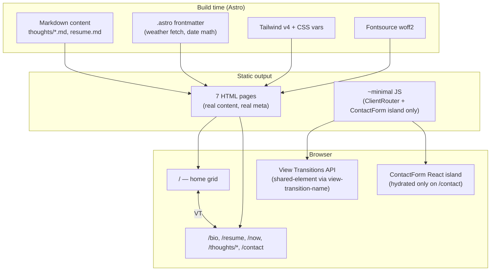

# feat: Notebook wunderkammer rebuild

Full rebuild of the personal site as a graph-paper "notebook" wunderkammer per the upstream brainstorm and design spec. Migrates from Vite + React-only (CSR) to **Astro + React islands** for SEO, while keeping Tailwind v4. Ships seven cards on the home grid, each opening its own route via the View Transitions API.

---

## Problem Frame

The current site (`src/`) is a single-page React app rendered client-side. Three things are wrong with it for the brainstorm's goals:

1. **SEO** — React + Vite ships an empty HTML shell; search engines see no content on first crawl. The brainstorm establishes engineering leaders as the imagined audience, who may land via search or shared link.
2. **Design** — the current layout is a conventional centered card on a pink background. It is the opposite of "place not page" and doesn't reflect the owner's actual taste.
3. **Maintenance shape** — content lives in `src/data/resume.json` and inline JSX. There is no story for adding essays, a `now` page, or new cards.

This plan replaces all three problems at once by rebuilding on Astro (static HTML output, content collections for Markdown), executing the design spec's "Notebook" direction (graph-paper grid, IBM Plex + Source Serif, ink-on-paper palette, View Transitions for card → route), and salvaging only what's worth keeping (the contact form's react-hook-form + zod logic).

---

## Requirements

Carried forward from `docs/brainstorms/personal-site-wunderkammer-requirements.md`:

- **R1** Seven cards on the home grid: bio, resume, contact, now, faster horse, novelty tax, criminal orders. (see origin: `docs/brainstorms/personal-site-wunderkammer-requirements.md` — V1 card set)
- **R2** Each card opens its own route; back nav returns to the grid.
- **R3** `now` page is staleness-resistant: visible "last updated", some auto-current slots, some manual slots, never implies a cadence it can't keep.
- **R4** Three essay cards (faster horse, novelty tax, criminal orders) launch with real prose.
- **R5** Existing contact form's behavior (validation, Formspree submission, success/error states) preserved; visual treatment replaced.
- **R6** Resume content sourced from `olga_nikulina_resume_rewrite.md` — single source of truth.
- **R7** Old `src/` structure is discarded; existing leaf favicon/brand is replaced.
- **R8** SEO-friendly rendering (real HTML in the response, meta tags, OpenGraph).
- **R9** Visual contract per `docs/design/personal-site-design-spec.md` — type system, color tokens, graph paper, asymmetric grid, three specific motions only.

---

## Scope Boundaries

### In Scope (v1)

- Migration from Vite-only to Astro + React islands (Tailwind v4 kept).
- All seven routes built and styled per the design spec.
- Self-hosted IBM Plex Sans, IBM Plex Mono, Source Serif 4 via Fontsource.
- Color tokens, graph paper background, asymmetric grid, card anatomy, three motions (CSS hover underline, View Transitions card → route, CSS pulse on `now` live slots).
- Contact form salvaged as a React island, re-styled.
- Resume parsed from `olga_nikulina_resume_rewrite.md` at build time.
- New favicon (replaces the leaf), small site mark in top-left of home grid.
- SEO baseline: `<title>` + meta description per route, OpenGraph image, sitemap, robots.txt.
- Three essays drafted and shipped live as Markdown.

### Deferred to Follow-Up Work

- **Hand-drawn marginalia SVGs** — design spec calls out as load-bearing but explicitly OK to defer. Add 2–3 after v1.
- **RSS feed** for `/thoughts/`.
- **Analytics** (Plausible / Umami / similar) — pick a tool, add later.
- **A dedicated `og:image` per route** — v1 uses a single site-wide OG image; per-route is post-launch polish.
- **404 page styled to match** — v1 uses Astro's default; restyle later.
- **`now` page auto-currency for "current GT class"** — needs a small data table of GT semester schedule + course; defer until first manual update would otherwise be needed.

### Outside this product's identity

(Verbatim from origin — `docs/brainstorms/personal-site-wunderkammer-requirements.md`.)

- Job-search funnel
- Blog with frequent posts and post counts
- Technical demo site whose primary purpose is interactive engineering work
- Personal brand vehicle with newsletter signups or audience-building affordances

---

## Key Technical Decisions

**Astro + React islands over Next.js.**
Astro ships zero JS by default and hydrates only the components that need interactivity. For a site that is structurally 95% static content (essays, resume, bio) with two interactive pieces (contact form, `now`-page liveness), Astro is the right shape. Next.js would also work but ships more JS and the App Router model is overkill for this. See brainstorm decision in chat history.

**View Transitions API over Framer Motion for card → route.**
The browser-native View Transitions API (via Astro's `<ClientRouter />`) gives us shared-element transitions between routes with `view-transition-name` CSS. Two reasons over Framer Motion: (1) zero added JS for this effect; (2) the API's natural "morph between two DOM states" model maps to the notebook page-turn metaphor better than a manual animation library. Browsers without support (older Safari, older Firefox) fall back to instant navigation — acceptable for the audience and the metaphor.

**Card hover underline in pure CSS.**
SVG stroke-dasharray transition for the title underline. No animation library needed for one effect.

**`now` page liveness via CSS keyframes.**
One-shot pulse on mount, single iteration. No JS required for the visual — auto-current *values* (date math, weather, etc.) are computed at build time (date-derived) or via a small server-side fetch in `.astro` frontmatter (weather). See Decision below on weather.

**Auto-current values computed at build time, not at request time.**
Astro is static-rendered. "Auto-current" means "current as of the last deploy" — which can be a daily scheduled rebuild via GitHub Actions later. For v1: build-time is fine. Anything computed in `.astro` frontmatter runs at build, so:
- Days-since-site-last-touched: trivially current at build.
- LA temperature/season: optional in v1. If included, fetched at build from a free API (e.g., Open-Meteo, no auth). If omitted, defer to follow-up. Recommending **include**, since the `now` page is the demo of liveness and weather is the most legible "actually current" signal.
- Current year/month: trivially current at build.

**Self-hosted fonts via Fontsource (`@fontsource-variable/ibm-plex-sans`, `@fontsource-variable/ibm-plex-mono`, `@fontsource/source-serif-4`).**
No external font requests, no CLS, no privacy issue. Bundle size impact: ~70-120kb total across the three families when subset to Latin. Acceptable for a site that ships almost no JS.

**Content collections for essays.**
Astro's `src/content/thoughts/*.md` directory with a zod-defined schema. Each essay is a Markdown file with frontmatter (title, slug, call number, published date, optional pull-quote). Adding a new essay = adding a file. The grid card list is derived from the collection.

**Resume sourced from `olga_nikulina_resume_rewrite.md`.**
Treated as a content-collection-of-one or imported via Astro's MD import. The `/resume` route renders that markdown with the typesetting spec. Editing the markdown updates the site. The old `src/data/resume.json` is deleted.

**Color tokens and type scale as CSS variables, not Tailwind theme extensions.**
Tailwind v4's `@theme` directive is fine, but the design system is small (~10 colors, ~7 type sizes) and using plain CSS variables + Tailwind's arbitrary-value syntax (`text-[var(--ink)]`) keeps the token wall in one CSS file where designers can read it without parsing JS config. Tailwind v4 supports this cleanly.

---

## Output Structure

```
.
├── astro.config.mjs                          # Astro + React + Tailwind v4 integration
├── package.json                              # Rewritten; new deps
├── public/
│   ├── favicon.svg                           # NEW — replaces leaf.ico
│   ├── og-image.png                          # NEW — site-wide OG image
│   ├── robots.txt                            # NEW
│   └── Olga_Nikulina_Resume.pdf              # KEPT — linked from /resume
├── src/
│   ├── content.config.ts                     # NEW — zod schemas for collections
│   ├── content/
│   │   ├── thoughts/
│   │   │   ├── faster-horse.md               # NEW — essay
│   │   │   ├── novelty-tax.md                # NEW — essay
│   │   │   └── criminal-orders.md            # NEW — essay
│   │   └── resume/
│   │       └── resume.md                     # NEW — symlink or copy of root resume MD
│   ├── components/
│   │   ├── Card.astro                        # NEW — grid card
│   │   ├── SiteHeader.astro                  # NEW — wordmark + back link
│   │   ├── GraphPaper.astro                  # NEW — background underlay
│   │   ├── Marginalia.astro                  # NEW — placeholder for SVGs (empty v1)
│   │   ├── NowSlot.astro                     # NEW — single slot on /now
│   │   └── ContactForm.tsx                   # MOVED + restyled React island
│   ├── layouts/
│   │   ├── BaseLayout.astro                  # NEW — html shell, fonts, meta, ClientRouter
│   │   ├── RouteLayout.astro                 # NEW — bio/resume/contact/now wrapper
│   │   └── EssayLayout.astro                 # NEW — essay typesetting wrapper
│   ├── pages/
│   │   ├── index.astro                       # NEW — home grid
│   │   ├── bio.astro
│   │   ├── resume.astro
│   │   ├── contact.astro
│   │   ├── now.astro
│   │   └── thoughts/
│   │       └── [slug].astro                  # NEW — dynamic essay route
│   ├── styles/
│   │   └── global.css                        # NEW — Tailwind import + CSS vars + font @font-face
│   └── lib/
│       ├── weather.ts                        # NEW — Open-Meteo fetch (build-time)
│       └── now-data.ts                       # NEW — manual now content
└── docs/                                     # Existing brainstorm + design + plans
```

The old `src/` (App.tsx, App.css, main.tsx, components/ContactForm.tsx, data/, types/, assets/, index.css) is **deleted** in U1.

---

## High-Level Technical Design

Below is the routing + rendering + interactivity model. *This illustrates the intended approach and is directional guidance for review, not implementation specification.*



**Card → route transition shape:** each card on the grid declares `view-transition-name: card-<slug>` in CSS. The matching route page's hero element declares the same name. The browser morphs between them on navigation. No JavaScript orchestration required beyond Astro's `<ClientRouter />` in the head.

---

## Implementation Units

### U1. Migrate from Vite + React to Astro + React islands

**Goal:** Replace the build system. After this unit lands, the project builds with Astro, produces static HTML, and the dev server runs. No design work yet — this is structural only.

**Requirements:** R7, R8.

**Dependencies:** none.

**Files:**
- Delete: `src/App.tsx`, `src/App.css`, `src/main.tsx`, `src/index.css`, `src/assets/`, `src/data/resume.json`, `src/types/resume.d.ts`, `src/vite-env.d.ts`, `index.html`, `vite.config.ts`, `tsconfig.app.json`, `tsconfig.node.json`, `public/leaf.ico`, `public/vite.svg`, `eslint.config.js`
- Keep: `public/Olga_Nikulina_Resume.pdf`, `public/profile.jpg` (for now; may delete in U3), `olga_nikulina_resume_rewrite.md`, `tsconfig.json` (rewrite)
- Move + keep: `src/components/ContactForm.tsx` (kept for restyling in U7; will move to new structure)
- Create: `astro.config.mjs`, `src/pages/index.astro` (placeholder "hello"), `src/layouts/BaseLayout.astro` (placeholder), `src/env.d.ts`
- Rewrite: `package.json`, `tsconfig.json`

**Approach:**
- Run `npm create astro@latest` mentally — but execute the migration in-place rather than scaffolding fresh and copying over. Cleaner git history.
- Add integrations: `@astrojs/react` (for the contact form island), Tailwind v4 via `@tailwindcss/vite` (already installed; keep the dep, change how it's wired — Astro uses the Vite plugin directly in `astro.config.mjs`).
- Add Fontsource deps in U2, not here.
- The placeholder `index.astro` just renders "hello, notebook" — proves the toolchain works.
- Verify `npm run dev` serves the placeholder and `npm run build` produces a `dist/` with real HTML.

**Patterns to follow:** Astro's standard project layout (`src/pages/`, `src/components/`, `src/layouts/`). No custom layout invention.

**Test scenarios:** *Test expectation: none — pure tooling migration with no behavioral logic. Verification is "dev server runs + build produces static HTML containing the placeholder string."*

**Verification:**
- `npm run dev` starts without errors and serves the placeholder page.
- `npm run build` produces `dist/index.html` containing literal "hello, notebook" text (i.e., real SSR, not a JS shell).
- `npm run lint` passes (Astro + TS config valid).
- Old SPA artifacts are gone from the working tree.

---

### U2. Establish the design system — tokens, fonts, Tailwind, graph paper

**Goal:** Codify the design spec as CSS. After this lands, any `.astro` file can use the type scale, color tokens, and graph-paper underlay. No content yet.

**Requirements:** R9.

**Dependencies:** U1.

**Files:**
- Create: `src/styles/global.css`
- Create: `src/components/GraphPaper.astro`
- Modify: `src/layouts/BaseLayout.astro` (import global.css, wire fonts, add GraphPaper)
- Modify: `package.json` (add Fontsource deps)

**Approach:**
- Add deps: `@fontsource-variable/ibm-plex-sans`, `@fontsource-variable/ibm-plex-mono`, `@fontsource/source-serif-4`.
- In `src/styles/global.css`:
  - `@import "tailwindcss";`
  - Import Fontsource CSS for the three families (latin subset only).
  - Declare `:root` CSS variables for the color palette per design spec (`--paper`, `--ink`, `--marker`, etc.).
  - Declare a Tailwind v4 `@theme` block mapping font families to the loaded fonts (`--font-sans`, `--font-mono`, `--font-serif`).
  - Declare a type scale via CSS variables matching the spec's table (`--text-xs` through `--text-display`).
  - Default `body { background: var(--paper); color: var(--ink); font-family: var(--font-sans); }`.
- `GraphPaper.astro` renders a fixed-position `<div>` with a CSS `background-image: linear-gradient(...)` producing the 24px grid. Positioned behind everything (`z-index: -1`), full viewport, set on the root element of any page that opts in.
- `BaseLayout.astro` becomes the canonical HTML shell: `<html lang="en">`, `<head>` with title slot, meta description slot, OG meta slot, `<ClientRouter />` (added in U4), Fontsource imports via the stylesheet, body. For now just wires the CSS.
- Test a sample page that renders text in each font + each color token to eyeball the result.

**Patterns to follow:** Tailwind v4's CSS-first config (`@theme` directive in CSS, not `tailwind.config.js`).

**Test scenarios:** *Test expectation: none — pure styling layer. Visual verification happens in U9.*

**Verification:**
- A test page renders Plex Sans body, Plex Mono inline metadata, and Source Serif 4 paragraph correctly.
- All color CSS variables resolve to the values in the design spec.
- Graph paper underlay is visible at the spec'd opacity (~`--grid-line` lines at 24px intervals).
- No network requests for fonts in the browser network tab (proves Fontsource self-hosting works).

---

### U3. Build the home grid layout and Card component

**Goal:** The home page renders a 12-col CSS grid with seven placeholder cards positioned per the design spec's grid table. Cards have their call-number, title, and optional subtitle. No routing yet, no hover effect yet, no real content.

**Requirements:** R1, R9.

**Dependencies:** U2.

**Files:**
- Create: `src/components/Card.astro`
- Modify: `src/pages/index.astro` (replace placeholder with real grid)
- Create: `src/components/SiteHeader.astro` (wordmark + favicon mark, top-left of grid)
- Create: `src/lib/cards.ts` (typed array of card metadata: slug, title, callNumber, subtitle, gridSpan)
- Delete: `public/profile.jpg` (no longer used — the bio route uses type, not a photo)

**Approach:**
- `src/lib/cards.ts` exports a typed array with the seven cards. This is the single source of truth for the grid order and metadata. Schema: `{ slug, href, title, callNumber, subtitle?, gridClass }` where `gridClass` is the Tailwind class string for that card's span (e.g., `"col-span-6 row-span-2"`).
- `Card.astro` takes `{ title, callNumber, subtitle?, href, gridClass }` props and renders:
  - Outer `<a href={href}>` with `class={gridClass}` and `class="card"` for shared styling
  - Inner: call-number top-left (mono, xs, ink-faint), title (sans medium, lg, ink), optional subtitle (sans, sm, ink-soft)
  - `--paper-soft` background at ~70% opacity so grid shows through
  - `view-transition-name: card-{slug}` inline style (used in U4)
- `index.astro` renders `<BaseLayout>` → `<SiteHeader />` → `<main class="grid grid-cols-12 gap-6 p-12">` → `cards.map(c => <Card {...c} />)`.
- `SiteHeader.astro` renders the small favicon mark + "olga nikulina" wordmark in lowercase sans medium, top-left.
- Mobile (`<768px`): override `grid-cols-12` to `grid-cols-1` and let cards stack in DOM order.

**Patterns to follow:** Astro component prop typing via TypeScript interfaces in the frontmatter. CSS Grid utilities from Tailwind v4.

**Test scenarios:**
- The home page renders exactly 7 cards.
- Cards appear in the order specified in `src/lib/cards.ts`.
- Each card displays its call-number, title, and (if present) subtitle.
- Card `href`s match the routes that will be built in U5.
- On mobile viewport (375px wide), cards stack single-column in DOM order.
- Graph paper background is visible through card fill.

**Verification:**
- Visit `/` — see the seven cards in the spec'd asymmetric layout on desktop, single-column on mobile.
- Each card is a working anchor (links resolve, even if the destination 404s pre-U5).
- No console errors, no network errors.

---

### U4. Wire navigation, View Transitions, and card hover

**Goal:** Cards navigate to their routes via Astro's `<ClientRouter />`. The card-to-route morph fires via the View Transitions API. Hovering a card draws the title underline in CSS.

**Requirements:** R2, R9.

**Dependencies:** U3.

**Files:**
- Modify: `src/layouts/BaseLayout.astro` (add `<ClientRouter />` to `<head>`)
- Modify: `src/components/Card.astro` (add `view-transition-name` and underline-on-hover CSS)
- Create: `src/layouts/RouteLayout.astro` (the destination side of the transition — has the same `view-transition-name` on its hero element)
- Create: `src/pages/bio.astro`, `src/pages/resume.astro`, `src/pages/contact.astro`, `src/pages/now.astro`, `src/pages/thoughts/[slug].astro` as **stubs** wrapped in `RouteLayout` (no real content yet — just title + back link). These will be filled in U5–U7.

**Approach:**
- `<ClientRouter />` added to `<BaseLayout>`'s `<head>`. Per Astro docs, this is the entire opt-in for View Transitions site-wide.
- `Card.astro` sets `style={`view-transition-name: card-${slug}`}` on its root anchor.
- `RouteLayout.astro` wraps its slot in a `<main>` with the matching `view-transition-name: card-${slug}` on the title block. Slug is passed as a prop from each page (`bio.astro` passes `slug="bio"`, etc.).
- CSS hover effect on `.card`:
  - The title has a `<span class="underline-svg">` containing an SVG line with `stroke-dasharray` set to the line length and `stroke-dashoffset` set to the same.
  - On `.card:hover .underline-svg`, transition `stroke-dashoffset` to `0` over 180ms ease-out.
  - Alternative if SVG is overkill: CSS `border-bottom` with `width: 0` → `100%` on hover, using `transition`. Decide in build — eyeball both.
- Stub route pages: each just renders its title in `text-2xl` and a `<a href="/" class="text-xs font-mono">← back</a>` in the top-left.
- The `[slug].astro` essay stub: use `getStaticPaths` to enumerate the three thought slugs from `src/lib/cards.ts` filtering to thoughts, render the slug as the title for now.

**Patterns to follow:** Astro's `<ClientRouter />` docs (verified via Context7). `getStaticPaths` for dynamic routes. Browser View Transitions API for shared-element transitions.

**Test scenarios:**
- Clicking a card on `/` navigates to its route (e.g., clicking the bio card navigates to `/bio`).
- In a browser supporting View Transitions (Chrome 111+), the card morphs into the destination route's title block during navigation.
- In an unsupported browser (test by feature-detecting `document.startViewTransition`), navigation is instant — no broken state.
- Hovering a card on `/` draws the underline beneath its title over ~180ms.
- Hover off — the underline retracts.
- `← back` on any route returns to `/` and the transition runs in reverse.
- All seven routes render their stub content (no 404s).

**Verification:**
- Manual screen recording on a Chrome browser shows the morph effect.
- Disabling JavaScript in the browser: navigation still works (just instant — proves graceful degradation).
- Keyboard nav (tab to a card, enter to navigate) works.

---

### U5. Build bio, contact, and now routes with real content

**Goal:** Three of the seven route pages have their final content and styling. Bio is prose. Contact is the salvaged form (restyled). Now is the alive page.

**Requirements:** R3, R5.

**Dependencies:** U4.

**Files:**
- Modify: `src/pages/bio.astro` (real bio prose)
- Modify: `src/pages/contact.astro` (host the ContactForm island)
- Modify: `src/pages/now.astro` (alive page)
- Modify: `src/components/ContactForm.tsx` (restyled per design spec — bottom-border inputs, no boxes, mono labels, text-link submit, `--marker` focus state. **Form logic unchanged**: keep `react-hook-form` + `zod` schema + Formspree POST + toast.)
- Create: `src/components/NowSlot.astro` (renders one slot: label in mono xs, value in either `--ink` for manual or `--marker` for live, with optional CSS pulse animation on live values)
- Create: `src/lib/now-data.ts` (exports the manual `now` content as a typed object: `currentlyReading`, `lastShipped`, `thinkingAbout`, etc., plus `lastUpdated` ISO date)
- Create: `src/lib/weather.ts` (Open-Meteo fetch helper, called at build time from `now.astro` frontmatter; returns `{ tempF, conditions } | null` — null on fetch failure so the page degrades gracefully)

**Approach:**
- **Bio:** plain prose in the `.astro` file. Name in `text-display`, intro in sans `text-base`, max-width `52ch`, generous line-height. ~150-300 words. The owner provides the prose; if not available at build time, ship with a short placeholder and a TODO comment.
- **Contact:** the route page just renders `<ContactForm client:load />` inside RouteLayout. The form component is restyled:
  - Remove `react-toastify` styling reset; toasts inherit page styling
  - Inputs: `border: none; border-bottom: 1px solid var(--ink-faint); background: transparent; padding: 0.5rem 0; font-family: var(--font-sans);`
  - Focus state: `border-bottom-color: var(--marker)`
  - Labels: `<label>` element above input, font-mono, text-xs, ink-soft
  - Submit: rendered as `<button>` styled as a text link (sans medium, marker color, no background, hover → marker-soft)
  - Toast container styled to match (or replaced with inline status — decide in build, preference inline)
- **Now:**
  - `now.astro` frontmatter calls `await getWeather()` (build-time fetch) and imports `nowData` from `src/lib/now-data.ts`.
  - Renders two columns on desktop, single column on mobile.
  - Auto-current slots (left column): "It's been N days since I touched this site" (computed from `nowData.lastUpdated`), "It's [N]°F in Los Angeles right now" (from weather fetch, falls back to season string if null), "It's [current month, current year]".
  - Manual slots (right column): "Currently reading", "Last thing I shipped", "Thinking about" — from `nowData`.
  - "last updated [date]" at the top in mono xs ink-soft.
  - Live values render in `--marker` with `animation: pulse 0.6s ease-out 1` on mount.

**Patterns to follow:** Astro frontmatter for build-time data fetching. React island with `client:load` for the contact form. Tailwind v4 arbitrary-value syntax for CSS vars (`text-[var(--ink-soft)]`).

**Test scenarios:**
- `/bio` renders the bio prose with correct typography (sans, text-base, max-w-[52ch]).
- `/contact` renders the form with restyled inputs (bottom-border only, no boxes).
- Submitting `/contact` with valid email + 10+ char message: form POSTs to Formspree, shows success state, resets fields. (Same behavior as the existing form — only styling changed.)
- Submitting with invalid email: shows "Invalid email address" inline error in `--emphasis` color.
- Submitting with short message: shows "Message must be at least 10 characters" inline error.
- `/now` renders both columns on desktop, single column on mobile.
- "Days since last touched" reflects the actual `lastUpdated` date in `now-data.ts` (manually verify the math after setting the date).
- Weather slot either shows real Los Angeles temperature OR a graceful fallback (e.g., "It's [season] in Los Angeles") if the fetch failed at build time.
- Live values (`--marker` color) visually distinct from manual values (`--ink`).
- Live values pulse once on page load.

**Verification:**
- All three routes render with their final content.
- Contact form sends a real test message to Formspree successfully.
- View source on `/now`: weather temperature appears as literal HTML (proves build-time fetch worked) — not via runtime JS.
- "last updated" timestamp is visible on `/now`.

---

### U6. Build resume route from `olga_nikulina_resume_rewrite.md`

**Goal:** The `/resume` route renders the contents of the existing resume Markdown as a typeset document. Editing the source Markdown updates the rendered route.

**Requirements:** R6.

**Dependencies:** U2 (design tokens).

**Files:**
- Create: `src/content/resume/resume.md` (copy or symlink of `olga_nikulina_resume_rewrite.md` — see Approach for which)
- Modify: `src/content.config.ts` (defines the resume content collection schema)
- Modify: `src/pages/resume.astro` (renders the resume)
- Modify: `src/styles/global.css` (add resume-specific typesetting: section headings, left-margin date column, etc.)

**Approach:**
- Astro content collections need files inside `src/content/`. Two options for the resume MD:
  - **Option A: copy** `olga_nikulina_resume_rewrite.md` to `src/content/resume/resume.md` (and add a note in the root MD that the canonical copy is in `src/content/`).
  - **Option B: symlink** `src/content/resume/resume.md` → `../../../olga_nikulina_resume_rewrite.md`.
  - **Recommendation: symlink.** Avoids two-source-of-truth drift. The user keeps editing the root file as they always have. (If cross-platform concerns arise on Windows checkouts later, swap to a build-time copy script — but for personal use on macOS, symlink is correct.)
- `src/content.config.ts` defines a `resume` collection with a zod schema. The resume MD has no frontmatter currently — either add minimal frontmatter (`---\nname: Olga Nikulina\nlocation: Los Angeles, CA\n---`) or render it raw without schema (use Astro's `import` syntax for raw MD instead of a collection).
  - **Recommendation: raw MD import.** Resume has only one entry; collection overhead isn't justified. Use `import { Content } from '../../olga_nikulina_resume_rewrite.md'` in `resume.astro` frontmatter, then render `<Content />`.
- `resume.astro` renders the imported `<Content />` inside an article element with:
  - Max-width ~70ch
  - Sans body, text-base
  - H2 (`## Professional Experience`, etc.) → text-xl medium, with thin hairline rule beneath
  - H3 (`### NuORDER by Lightspeed`) → text-lg medium, with date in mono xs ink-soft on the right
  - Lists → bullet style overridden to use `--ink-faint` for the bullet character
  - A small "download PDF" link at the bottom right: mono text-sm marker color, pointing at `/Olga_Nikulina_Resume.pdf` (kept in `public/`)
- Add a `prose`-like class set in `global.css` scoped to `.resume-prose` rather than using `@tailwindcss/typography` (we want full control over the typesetting per design spec; the typography plugin would override our tokens).

**Patterns to follow:** Astro's raw MD import + `<Content />` rendering. Tailwind v4 arbitrary-value classes for CSS vars.

**Test scenarios:**
- `/resume` renders all sections from `olga_nikulina_resume_rewrite.md` in document order.
- All section headings (`## Professional Summary`, `## Professional Experience`, `## Skills`, `## Education`) render as text-xl medium.
- All subsection headings (company names) render as text-lg medium with date on the right.
- Bullets render with `--ink-faint` bullet character.
- "Download PDF" link is visible at the bottom and resolves to `/Olga_Nikulina_Resume.pdf`.
- Editing the source Markdown (`olga_nikulina_resume_rewrite.md`) and rebuilding: the change reflects on `/resume`. *Verifies single-source-of-truth.*

**Verification:**
- View source: real HTML resume content in the response (not a JS shell).
- Download PDF link works.
- Mobile rendering: typography scales, no horizontal scroll.

---

### U7. Build essay routes from content collection

**Goal:** Three essay routes (`/thoughts/faster-horse`, `/thoughts/novelty-tax`, `/thoughts/criminal-orders`) render their Markdown content with the essay typesetting (Source Serif 4, generous reading width). Adding a new essay file in `src/content/thoughts/` automatically creates a new route.

**Requirements:** R4.

**Dependencies:** U2 (design tokens), U4 (the `[slug].astro` stub).

**Files:**
- Create: `src/content/thoughts/faster-horse.md`
- Create: `src/content/thoughts/novelty-tax.md`
- Create: `src/content/thoughts/criminal-orders.md`
- Modify: `src/content.config.ts` (define the `thoughts` collection schema)
- Modify: `src/pages/thoughts/[slug].astro` (replace stub with real render)
- Create: `src/layouts/EssayLayout.astro`
- Modify: `src/styles/global.css` (essay-specific prose styles)

**Approach:**
- `src/content.config.ts` defines the `thoughts` collection with zod schema:
  ```
  fields:
    title: string
    slug: string (optional — derived from filename)
    callNumber: string (e.g., "t-01")
    publishedDate: date (optional)
    pullQuote: string (optional)
  ```
- Each essay file starts with frontmatter matching the schema, then Markdown body.
- `[slug].astro` uses `getStaticPaths` to enumerate all thoughts entries and render each at its slug. Uses `EssayLayout` for the body.
- `EssayLayout.astro` provides the typesetting:
  - Source Serif 4 body, text-lg, line-height 1.65, max-width ~62ch
  - Title in sans text-2xl medium above the body
  - "← back" link top-left
  - "previous / next essay" link pair at the bottom, mono text-xs, using the next/prev entries from the collection by `callNumber` order
  - Graph paper underlay set to display:none on essay routes (per design spec — reading takes over)
- The three essay files contain real prose. Per scope-call-outs: the owner provides drafts. If unavailable at plan-execution time, ship with short placeholder content (200-500 words each) so v1 ships on time, and the owner can replace via simple Markdown edits.
- Update `src/lib/cards.ts` so the three thought cards' `href` values match `/thoughts/<slug>`.

**Patterns to follow:** Astro content collections with zod schemas. `getStaticPaths` for dynamic routes. Per-route layout slot pattern.

**Test scenarios:**
- `/thoughts/faster-horse`, `/thoughts/novelty-tax`, `/thoughts/criminal-orders` all render their respective Markdown content.
- Body text uses Source Serif 4 at text-lg, line-height 1.65.
- Title above the essay uses sans text-2xl medium.
- "← back" link returns to `/`.
- "previous / next" links appear at the bottom and resolve correctly (faster-horse → novelty-tax → criminal-orders → wraps or stops; decide based on personal preference, recommend stops at ends).
- Graph paper is NOT visible on essay routes (`display: none` or equivalent).
- Adding a fourth Markdown file to `src/content/thoughts/` and rebuilding: a new route appears with no other code change. *Verifies the content pipeline.*
- An essay with no `pullQuote` in frontmatter still renders without errors.
- An essay file with malformed frontmatter (e.g., missing required `title`) causes a build-time error (proves zod schema is enforced).

**Verification:**
- All three essays readable in browser.
- View source: real essay content in HTML (SEO win).
- New-essay-by-adding-file workflow demonstrated by adding a throwaway essay and confirming the route appears, then deleting it.

---

### U8. SEO, OpenGraph, favicon, and site metadata

**Goal:** Every route has correct `<title>`, meta description, OG tags, and the new favicon. `robots.txt` and `sitemap.xml` exist. Search engines and link-unfurlers see a polished site.

**Requirements:** R7, R8.

**Dependencies:** U5, U6, U7 (all routes have real content to describe).

**Files:**
- Create: `public/favicon.svg` (new mark per design spec — graph-paper-square-with-ink mark)
- Create: `public/og-image.png` (1200×630, site-wide OG image — can be a simple typographic treatment matching the design)
- Create: `public/robots.txt`
- Modify: `astro.config.mjs` (add `@astrojs/sitemap` integration, set `site: 'https://www.olganikulina.dev'`)
- Modify: `src/layouts/BaseLayout.astro` (accept `title`, `description`, `ogImage?` props; emit standard + OG meta tags; reference favicon)
- Modify: each `src/pages/*.astro` and `src/layouts/EssayLayout.astro` (pass per-route title and description to BaseLayout)
- Add dep: `@astrojs/sitemap`

**Approach:**
- `favicon.svg`: a 32×32 SVG of a small graph-paper-square mark with a single ink mark inside. Owner provides or designer-tooling generates; placeholder acceptable for first deploy.
- `og-image.png`: a 1200×630 PNG with "olga nikulina" in IBM Plex Sans medium centered on `--paper` background. Can be generated once and committed; not regenerated per route in v1.
- `robots.txt`: standard `User-agent: *\nAllow: /\nSitemap: https://www.olganikulina.dev/sitemap-index.xml`.
- `BaseLayout.astro` emits:
  - `<title>{title} — olga nikulina</title>`
  - `<meta name="description" content={description}>`
  - `<meta property="og:title" content={title}>`
  - `<meta property="og:description" content={description}>`
  - `<meta property="og:image" content={ogImage ?? '/og-image.png'}>`
  - `<meta property="og:url" content={canonicalUrl}>`
  - `<meta property="og:type" content="website">` (or `article` for thoughts)
  - `<meta name="twitter:card" content="summary_large_image">`
  - `<link rel="icon" type="image/svg+xml" href="/favicon.svg">`
  - `<link rel="canonical" href={canonicalUrl}>`
- Per-route titles and descriptions: each page passes them. Examples:
  - `/`: title="home", description="a small notebook by olga nikulina, engineering lead and engineer."
  - `/bio`: title="bio", description="who I am, in brief."
  - `/resume`: title="resume", description="ten years of building, leading, and shipping software."
  - `/thoughts/faster-horse`: title from frontmatter, description from frontmatter (or first 160 chars of body if not specified).

**Patterns to follow:** `@astrojs/sitemap` standard config (auto-discovers routes). Astro slot-based meta pattern (define props in BaseLayout, pages pass them).

**Test scenarios:**
- Visiting `/` and viewing source: correct `<title>`, meta description, OG tags present.
- Each of the seven routes has a distinct `<title>` and meta description.
- `/sitemap-index.xml` exists post-build and lists all seven routes.
- `/robots.txt` exists and references the sitemap.
- `/favicon.svg` exists and is referenced from every page's `<link rel="icon">`.
- An OG link preview tool (e.g., opengraph.xyz) successfully unfurls the URL with title + description + image.
- The old `/leaf.ico` file is gone from `public/`.

**Verification:**
- Build the site, deploy to a preview environment, run the OG link unfurler.
- Browser tab shows the new favicon.
- Lighthouse SEO score on the home page is 100/100 (or close, with any deductions understood).

---

### U9. Visual verification, polish, and content review

**Goal:** Open the running site, walk through every route, verify against the design spec's litmus checks, and fix any glaring issues. Land any small visual corrections.

**Requirements:** R9.

**Dependencies:** U1–U8.

**Files:**
- Modify: any files that need visual touch-ups uncovered during walkthrough (e.g., spacing tweaks, color contrast adjustments).
- This unit creates no new files by default.

**Approach:**
- Use the existing Playwright/Chrome DevTools MCP if available, or run `npm run dev` and use a real browser.
- Walk through every route in order: `/`, `/bio`, `/resume`, `/contact`, `/now`, `/thoughts/faster-horse`, `/thoughts/novelty-tax`, `/thoughts/criminal-orders`. Screenshot each on desktop (1440px) and mobile (375px).
- Validate against the design spec's litmus checks:
  - [ ] Home grid is unmistakably NOT a SaaS dashboard
  - [ ] Card titles + call-numbers alone convey what's on the site
  - [ ] Removing all decoration would still leave considered typography
  - [ ] Live `now` slots visibly distinct from manual without labels
  - [ ] Site looks like the same person who wrote the essays designed it
  - [ ] No default Inter/system-sans anywhere
- Lighthouse: accessibility ≥95, performance ≥95, SEO ≥95.
- Fix any visual issues found. Examples that may surface: contact form input alignment, mobile graph-paper density, essay-route line-height edge cases, View Transitions glitches on specific routes.
- Run `npm run build` once more to verify everything still builds clean post-touch-ups.

**Test scenarios:**
- Visual review of every route on desktop + mobile.
- Lighthouse audit: SEO, Performance, Accessibility, Best Practices all ≥95.
- Tab keyboard navigation: every interactive element is reachable and has a visible focus state.
- Color contrast spot-check: `--ink` on `--paper`, `--ink-soft` on `--paper`, `--marker` on `--paper` all meet WCAG AA.
- View Transitions work on Chrome (manual verify).
- Disabling JS: full site remains usable (no broken interactivity beyond the contact form requiring JS).

**Verification:**
- Screenshots of every route attached to PR description (use `ce-demo-reel` skill if appropriate).
- Lighthouse scores documented.
- Sign-off from owner that the site matches the intent.

---

## System-Wide Impact

This is a full rebuild of a small standalone site. There are no other systems to consider — no shared package, no consumed API, no other repo depending on this.

The only external dependencies are:
- **Formspree** — the contact form continues to POST to the existing endpoint (`https://formspree.io/f/xeogqyzg`). No change to that integration.
- **Open-Meteo** (new) — build-time weather fetch for the `/now` page. No auth, no rate-limit concern at one fetch per build, gracefully degrades if unreachable.
- **Vercel / Netlify / wherever it currently deploys** — Astro outputs `dist/` static files; should work on any static host. Verify the existing deploy target supports static-site deploys (most do); if it's a Vite-specific config, update the deploy config in the same PR.

---

## Risks and Mitigations

- **Risk: Astro + Tailwind v4 setup quirks.** Tailwind v4 is recent and the Astro integration has evolved. Mitigation: U1 verification gate explicitly checks the build works before any design work begins. If Tailwind v4 conflicts emerge, fall back to Tailwind v3 (which is well-trodden in Astro). Decision deferred to implementation time.
- **Risk: View Transitions don't morph as expected.** Browser View Transitions can behave unexpectedly with element sizes that change dramatically. Mitigation: U4 verification includes manual transition check; if the morph looks bad, fall back to a simple cross-fade (still using `<ClientRouter />` — just without the `view-transition-name` matching). Site still works.
- **Risk: Essay drafts aren't ready at build time.** Per scope-call-outs, the owner is on the hook for essay prose. Mitigation: U7 explicitly allows shipping with 200-500 word placeholder essays; updating is a Markdown edit, no rebuild-of-anything-else needed.
- **Risk: Symlinked resume MD breaks on a non-macOS checkout.** Mitigation: option to fall back to a build-time copy script. Personal use on macOS makes this low-priority.
- **Risk: The design under-delivers vs. the spec.** "Notebook" depends on typography + spacing discipline. Mitigation: U9 visual verification is its own unit specifically to catch this; willing to spend that unit on polish.

---

## Open Questions Deferred to Implementation

- Exact `--paper-soft` opacity for cards over the graph paper — eyeball in U3.
- Whether the title hover underline is implemented in SVG or CSS border — eyeball in U4.
- Whether the contact form keeps `react-toastify` or switches to inline status — preference inline, but decide in U5 once the form is restyled.
- Whether "previous / next" essay navigation wraps or stops at the ends — decide in U7 based on personal preference.
- Whether to use a build-time copy script or symlink for the resume MD — symlink for v1, swap if Windows-checkout needs ever arise.
- Whether to add per-thought OG images (deferred per scope boundaries) or stick with the site-wide one in v1.

---

## Deferred to Follow-Up Work

(Restated from Scope Boundaries for execution clarity — these explicitly do not block v1.)

- Hand-drawn marginalia SVGs.
- RSS feed for `/thoughts/`.
- Analytics tooling.
- Per-route OG images.
- Custom 404 page.
- `now` page auto-current "current GT class" slot.
